# Створення схеми (iFlow) для відправки push-повідомлень у SAP Build Work Zone та SAP Mobile Start з допомогою системи SAP Integration Suite.

Для роботи по даній документації необхідно вже мати налаштовані наступні параметри та системи:

- Серівіс SAP Integration Suite встановлений в BTP
- Для користувача надані всі необхіні права

## Необхідні кроки для виконання завдання:
1. Налаштування в SAP Build Work Zone
2. Налаштування в BTP
3. Конфігурація SAP Integration Suite
4. Налаштування Postman для відправки даних

### 1. Налаштування в SAP WorkZone.
### 1.1 Активація push-повідомлень.

Для того, щоб мати можливість отримувати повідомлення в Work Zone та на мобільні пристрої в програмі SAP Start необхідно активувати цю можливість в роділі Settings (див. рис. 1). Після активації цього розділу ми отримаємо всі необхідні параметри для авторизації в найбутньому, в налаштуваннях в BTP (розділ 2).

### Рис.1
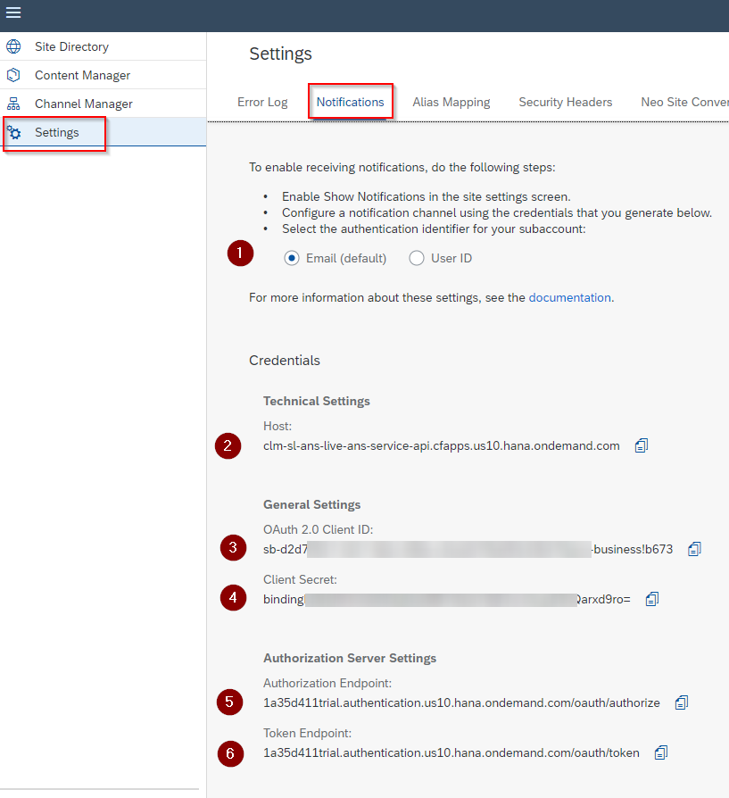

### 2. Налаштування в BTP.
### 2.1. Створення Destinations
Для звязку Work Zone та сервісів з BTP необхідно створити Destinations та прописати в нього ті дані, які ми отримали в Work Zone. Destinations можна створити вручну "з нуля" а також можна використати функцію імпорту і завантажити файл SAP_Notifications з репозиторію.

> **Важливо**: Destinations повинно мати саме ім'я SAP_Notifications. На це ім'я як на ідентифікатор буде відсилатися схема (розділ 3)

### Рис.2
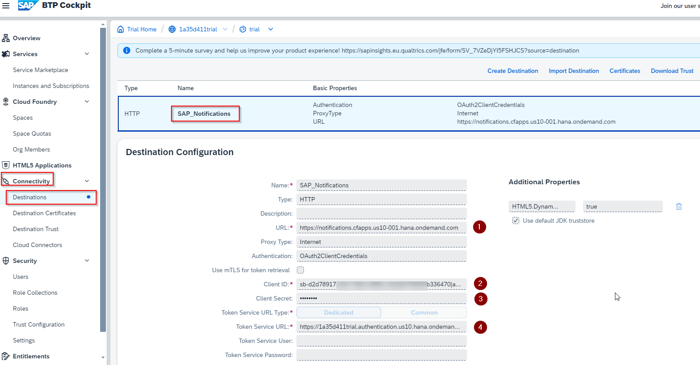


Налаштування для Destinations
| Параметр                                    | Значення                  |
| ------------------------------------------ | --------------------- |
| Name | SAP_Notifications           |
| Type          | HTTP            |
| URL                        | Залежить від зони BTP. Для зони us10 це значення https://notifications.cfapps.us10-001.hana.ondemand.com                  |
| Proxy Type       | Internet |
| Authentication       | OAuth2ClientCredentials |
| Client ID       | Значення з Work Zone рис.1 зн.3  |
| Client Secret       | Значення з Work Zone рис.1 зн.4  |
| Token Service URL       | Значення з Work Zone рис.1 зн.6  |

### 2.2. Створення Інстанса з типом Destination Service
Для зв'язку сервіса CPI з Destinations необхідно створити Інстанс з ключем доступу.
Інстанс створюється через кнопку Create в розділі "Instances and Subscriptions" (рис. 3) Використайте параметри вказані на рисунку.

### Рис.3
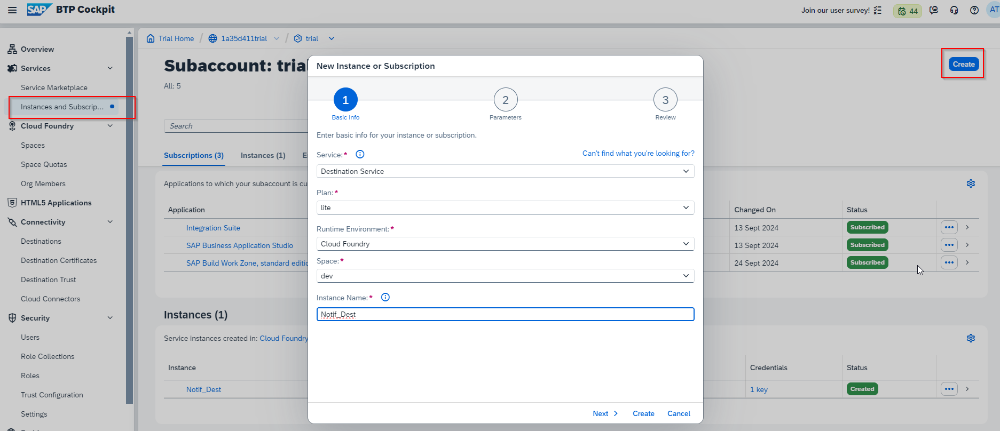

Створиться запис в розділі Instances. Для цього запису необхідно створити сервісний ключ (рис.4). 

### Рис. 4
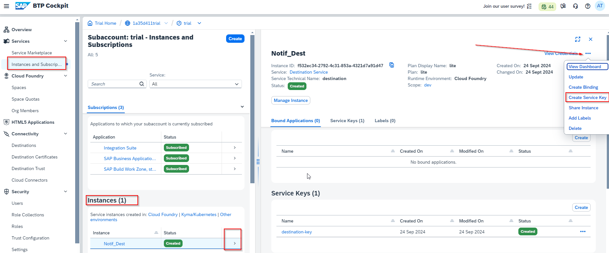

Під час створення нового ключа, необхідно лише вказати його ім'я. Всі інші поля залишаємо незаповнені (рис.5).

### Рис.5
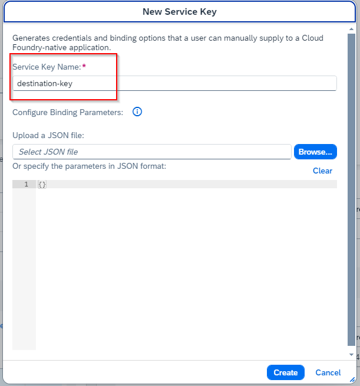

З даного ключа, нам в наступних кроках будуть необхідні дані clientid та clientsecret. Переглянути ці дані можна з кнопки на рис. 6 позиція 1

### Рис.6
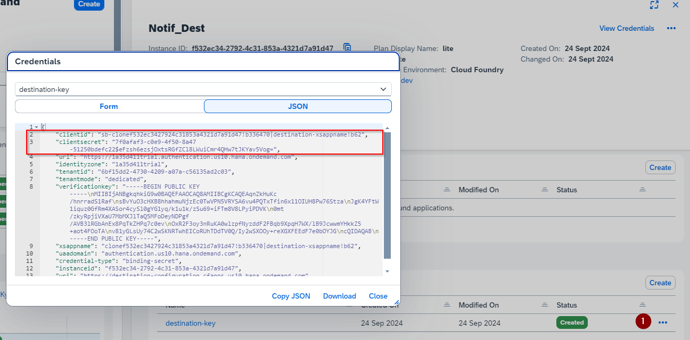

### 2.3. Надати користувачу роль для відправки повідомлень в SAP CPI
Для того, щоб в наступних кроках, мати можливість відправляти повідомлення з Postman необхідно, щоб в користувача були відповідні права. Користувач повинен мати роль `MessagingSend`. Цю роль необхідно привязати до будь якої "Role Collections". В нашому випадку є колекція ролей, яка була автоматично створена - `trial-content-support`.  І саме до неї ми привяжемо і роль і користувача.
Одже знаходимо колекцію `trial-content-support` та переходимо до її редагування (рис. 7 та рис. 8)

### Рис.7
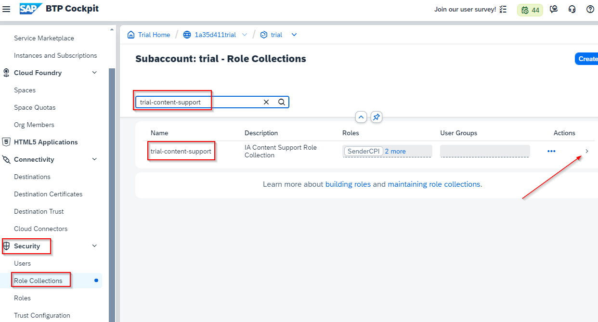

### Рис.8
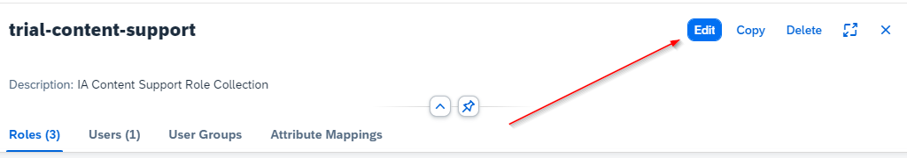

Потім в розділі Users в полі Search починаємо набирати ємейл свого користувача. Він має підягнутися з пошуку (рис. 9).  

### Рис.9
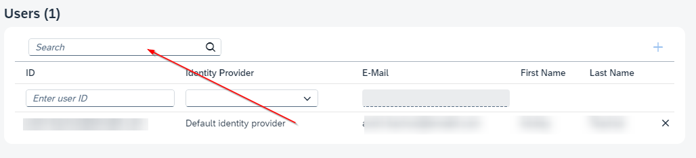

Так само треба прив'язати роль `MessagingSend` в розділі Roles як показано на рис. 10.
Обовязково зміни треба зберегти натиснувши Save у верхній частині.

### Рис.10
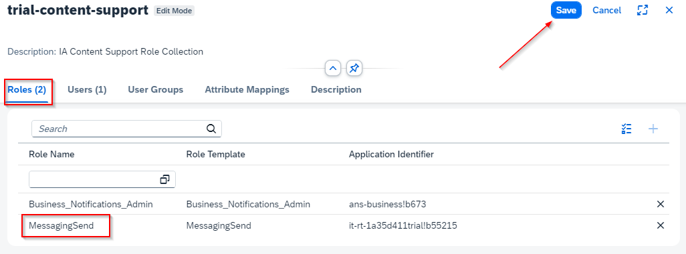

### 3. Конфігурація SAP Integration Suite
На даному кроці передбачається, що сервіс Integration Suite вже розгорнутий і користувач має всі необхідні права для роботи з ним. Так як це вказано в місії.
Ми використаємо вже готову, свторену раніше схему і не будемо зупинятися на її детальному розгляді. Лише розглянемо загальні частини. 
В першу чергу, нам необхідно створити "User Credentials", які забеспечать нам доспут до BTP і звязок з Work Zone (рис. 11).

### Рис.11
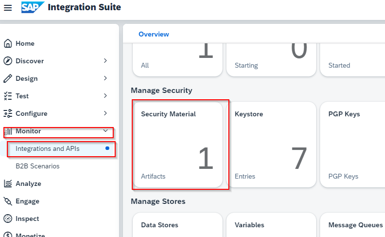

User Credentials - це розділ, де зберігаються логіни і паролі, які використовуються в схемах (iFlow)
Для створення такої зв'язки "логін-пароль" необхідно натиснути кнопуку Create та вибрати User Credentials.
Вкажіть поля Name та Type так як показано на рис.12

> **Важливо**: Ім'я "креденшенела" повинно бути саме `dest`. Це ім'я буде в подальшому схема для авторизації на платформі BTP.

Поля User та Password це відповідно clientid та clientsecret з ключа, який ми створювали в п.2.2 і показані на рис.6.

### Рис.12
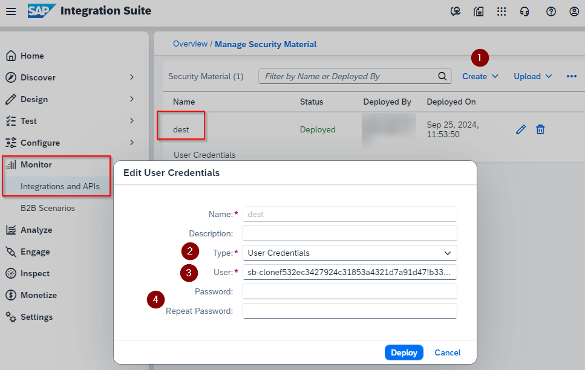

Далі створюємо пакет, який буде містити наші схеми. Його назва може бути довільна. Важливо заповнити всі поля, які відмічені *(зірочкою) як обов'язкові. 
Переходимо в розділ Design - Integration and APIs і натискаємо кнопку Create (рис.13)

### Рис.13
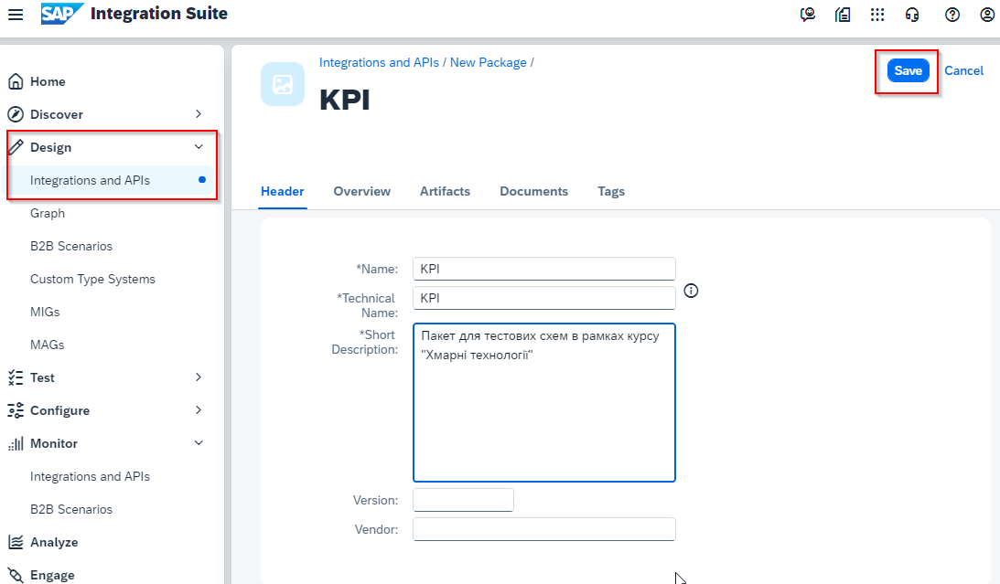

Зберігаємо пакет і переходимо в ньому в розідл Artifacts. В цьому розділі знаходяться "артифакти" для інтеграцій. Це і схеми, і API і скріпти та ще багато чого. Нам необхідно перейти в режим редагування, натиснувши кнопку Edit (рис.14).

### Рис.14
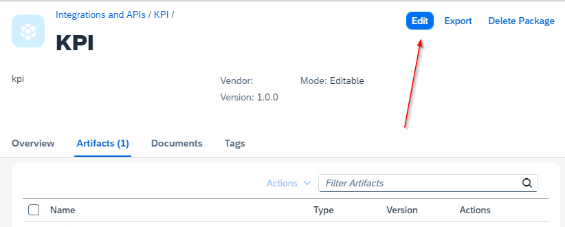

Після цього зєявиться кнопка Add і треба вибрати пункт Integration Flow (рис.15).

### Рис.15
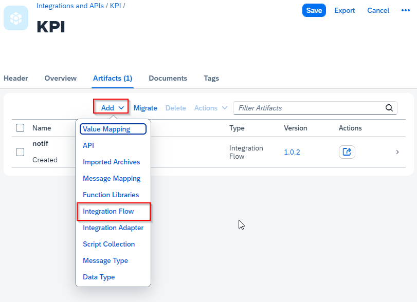

В діалоговому вікні треба вибрати варіант Upload і потім з допомогою кнопки Browse обрати файл notif.zip з даного репозеторію.
Всі поля для нової схеми мають автоматично заповнитися і нам лише залишається натиснути кнопку Add.
Схема добавлена в наш пакет. Перш ніж почати її використовувати, ми повинні налаштувати її згідно своїх даних. Це робиться з допомогою кнопки Actions і команди Configure (рис.16)

### Рис.16
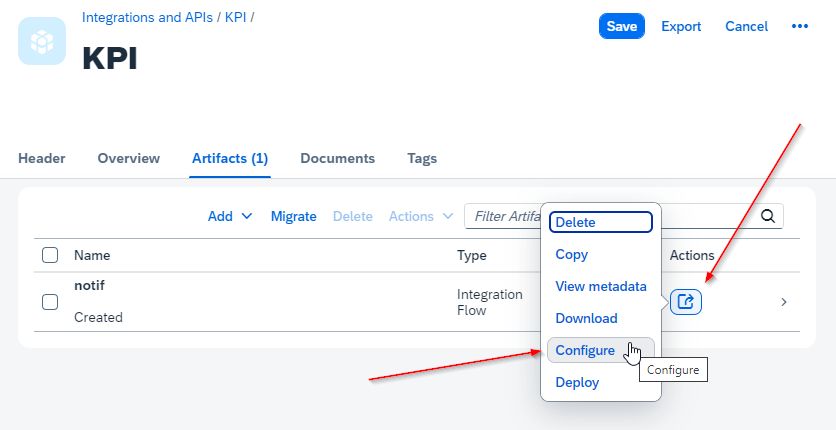

Для того, щоб одразу бачити всі параметри треба перейти на закладку "More" (рис.17).
### Рис.17
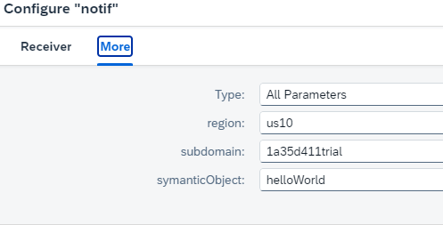

Region - це регіон в якому рохгорнуте наше клауд-середовище, тобто BTP. На момент написання цієї статті основним регіоном був `us10`. 
Subdomain - він так само як і регіон вказаний на сторінці Overview вашого BTP Cockpit (рис.18)
symanticObject - це назва аплікації, яку ви вказали при налаштуванні її в Work Zone. Саме з допомогою цього параметру можна казати яку ui5 аплікацію треба відкрити коли відбувся "клік" по пушу.
### Рис.18
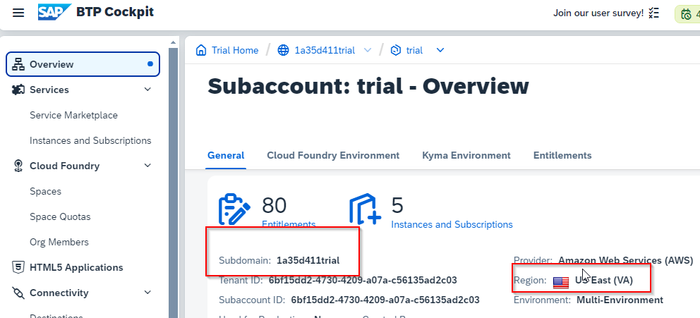

Після того як схема налаштована, її необхідно "задеплоїти" і тоді ми отримаємо url (endpoint), на який ми зможемо відправити дані для пуша. Це робиться за допомогою команди Deploy з меню, яке вказане на рис.16.

Якщо все налаштовано правильно, то результат має бути видно в розділі Monitor - Integration and APIs, як показано на рис.19. Нам необхіно вибрати дану плиточку і подивитися як задеплоїлась наша схема і який endpoint вона отримала (рис.20).
### Рис.19
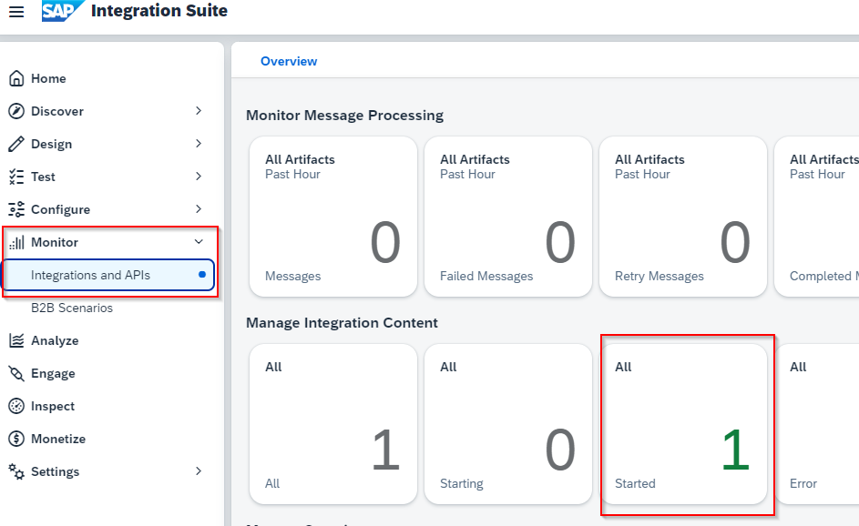

### Рис.20
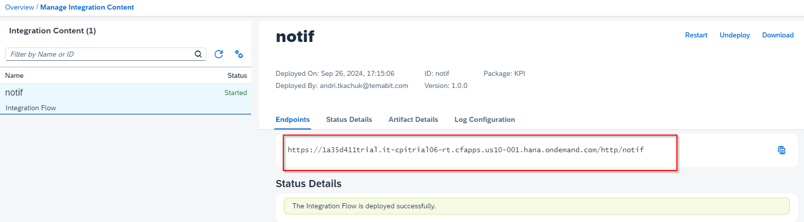

Ми використаємо цей endpoint в програмі Postman для відправки повідомлення.


### 4. Налаштування Postman для відправки даних
Postman - це програма яка робить http-запити на будь який ендпоїнт. Вона має всі необхідні можливості, щоб працювати web API або їх тестувати. Ми використаємо її, щоб зробити POST-запит на наш endpoint створений в п.3. 
Основнити параметрами для запиту є:
URL - це ендпоїн з CPI (рис.20)
Тип запиту - в нас це POST.
Тип авторизаці - Basic Auth
Логін та пароль - це ємел та пароль, який використовується для доступу в BTP.
Приклад вказано на рис. 21.
### Рис.21
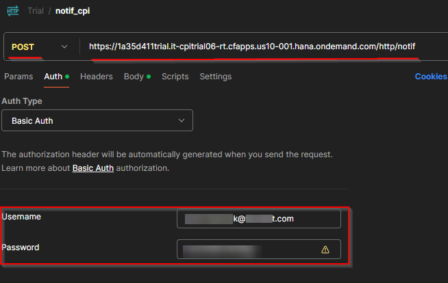

Далі ми маємо вказати дані, з якими має відправитися наше повідомлення. 
А саме: своє імя та прізвище, факультет-група, код перевіркти (вказується викладачем) та ємейл, який має отримати це повідомлення. Ці дані вказуються в блоці BODY і мають структуру JSON.

Приклад:
```properties
{
    "firstName": "Григорій",
    "lastName": "Сковорода",
    "department": "GMF",
    "verificationCode": "200",
    "email":"student@gmail.com"
}
```

Результат показаний на рис.22
### Рис.22
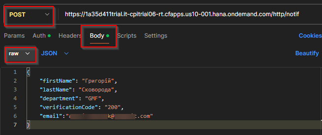

Нам залишається натиснути кнопку Send і шукати наше повідомлення в Work Zone та на мобільних пристороях в програмі SAP Start.